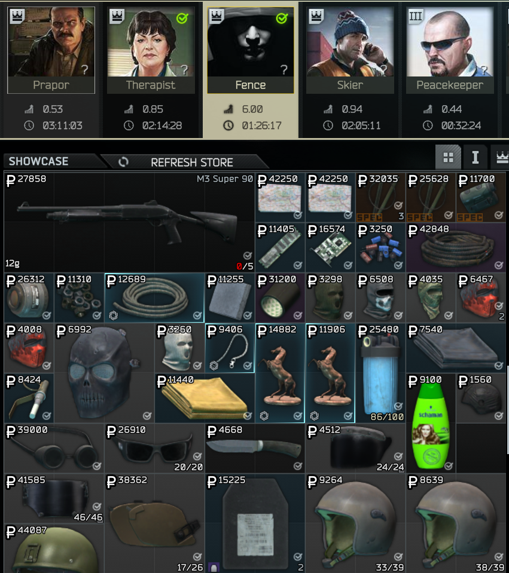

# FIR Fence Purchases

[)](https://github.com/Tosox/SPT-FIRFencePurchases/releases) [)](https://github.com/Tosox/SPT-FIRFencePurchases/releases/latest)

## 📜 Description

Give Fence’s stock a boost! **FIR Fence Purchases** for *Single Player Tarkov* ensures that every item you buy from Fence is marked as *Found in Raid*.

## 📁 Installation

* Download the latest release
* Copy the `SPT_Runtime` folder into your SPT installation
* Start the game

## 📝 Changelog

You can check out the latest changes in [`CHANGELOG.md`](CHANGELOG.md).

## 📷 Preview

## 📄 License

Distributed under the MIT License. See `LICENSE` for more information.
